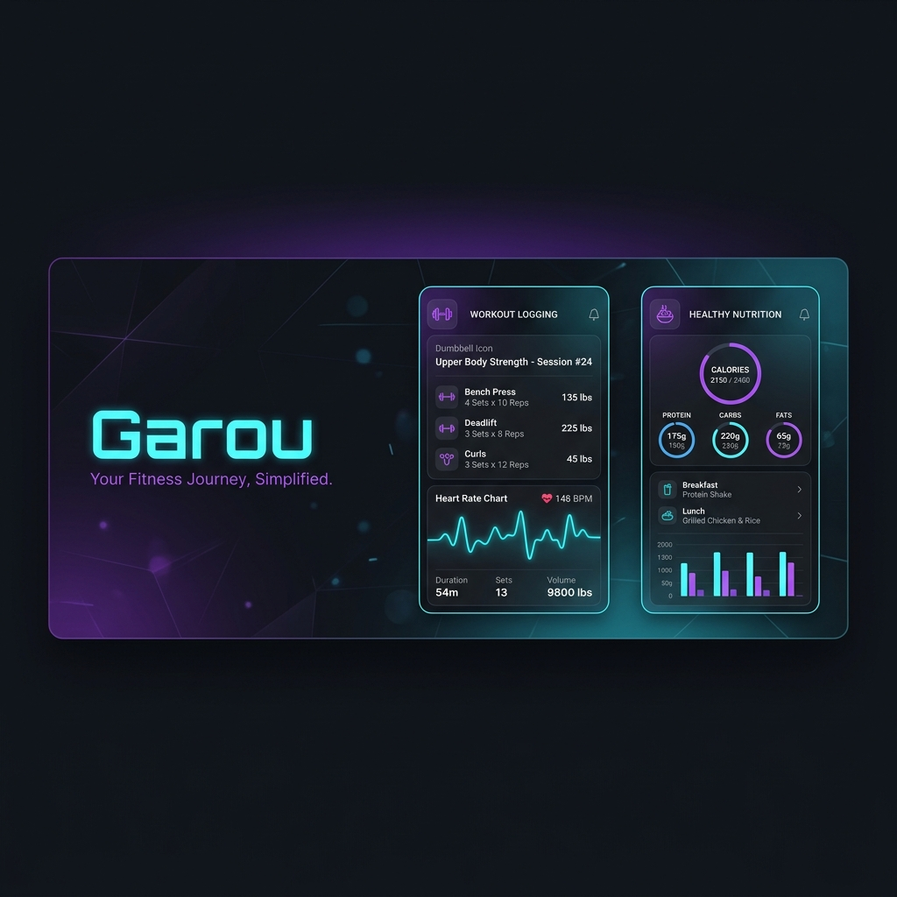

# 🐺 Garou

[](https://expo.dev/)
[](https://www.typescriptlang.org/)
[](https://www.sqlite.org/)
[](https://developer.android.com/health-and-fitness/guides/health-connect)
[](https://opensource.org/licenses/MIT)

**Garou** es una aplicación móvil Android de uso personal e independiente para llevar un registro milimétrico de tu **entrenamiento de hipertrofia**, **nutrición de recomposición corporal** y **métricas de progreso**.

Diseñada bajo un enfoque totalmente local (*offline-first*), la aplicación prioriza la privacidad absoluta de tus datos de entrenamiento y salud. Toda la información se almacena localmente en el dispositivo mediante SQLite y se sincroniza con wearables (Galaxy Watch 7 / WearOS) a través de la API Health Connect de Android.

---



---

## 🚀 Características Clave

### 🏋️ Registro de Entrenamiento Inteligente
*   **Doble Progresión Calculada**: Implementa un algoritmo de progresión (`src/utils/progression.ts`) que analiza tus últimas sesiones. Te indica visualmente cuándo estás listo para subir cargas al haber completado el rango superior de repeticiones objetivo con RIR $\le$ objetivo durante 2 sesiones consecutivas.
*   **Sugerencia Dinámica de Rutina**: Detecta el día de la semana del sistema para proponer la sesión del día (Lunes: *Torso A*, Martes: *Pierna A*, Miércoles: *Ligero*, Jueves: *Torso B*, Viernes: *Pierna B*, Sábado/Domingo: *descanso*). Soporta cambio de rutina manual instantáneo con persistencia inmediata en la base de datos.
*   **Registro Veloz (Máx. 2 toques)**: Autocompleta automáticamente las cargas y repeticiones basándose en tu última sesión para el ejercicio correspondiente, agilizando el flujo durante tus descansos.

### 🍎 Nutrición e Hidratación de Recomposición
*   **Protein Anchor**: La proteína diaria está fija en $160\text{ g}$ como pilar indispensable. Los carbohidratos y grasas se ajustan dinámicamente según el objetivo calórico del tipo de día.
*   **Calorías por Tipo de Día**: Objetivos diferenciados para días de entrenamiento (~2,500 kcal) y días de descanso (~2,200 kcal).
*   **Cálculo al Vuelo**: Las calorías nunca se guardan pre-calculadas en la base de datos para evitar inconsistencias; se calculan en tiempo real a partir de los gramos de macronutrientes registrados.
*   **Registro de Agua**: Contador rápido para registrar ingesta de agua en mililitros (ml).

### 📈 Gráficas y Métricas de Progreso
*   **Promedio Móvil de Peso**: Calcula el promedio móvil de los últimos 7 días registrados para mitigar fluctuaciones naturales de retención de líquidos, calculando además la tendencia semanal (subiendo, bajando o estable).
*   **Normalización de Fuerza Multiuso**: Convierte y normaliza en memoria unidades mixtas (`lb`, `placas` de máquinas, o peso corporal `bw` utilizando tu último peso registrado) a kilogramos (`kg`) para graficar la progresión de fuerza de manera correcta. Mantiene la visualización de los puntos del gráfico con su valor y unidad originales en las etiquetas.
*   **Buscador Modal de Ejercicios**: Reemplaza carruseles engorrosos por un panel modal vertical translúcido y fluido para seleccionar el ejercicio del que deseas ver el progreso.

### ⏱️ Temporizador de Descanso Resiliente
*   **Segundo Plano Notifee**: Temporizador integrado que sigue funcionando en segundo plano y te notifica cuando termina tu descanso.
*   **Prevención de Duplicados**: Al saltar o cancelar un temporizador, se cancelan tanto la notificación en el cajón de Android como las alarmas programadas en el sistema (`cancelTriggerNotification`), limpiando la base de datos SQLite por completo.

### ⌚ Sincronización Health Connect (Galaxy Watch 7 / WearOS)
*   **Métricas de Recuperación**: Sincroniza datos diarios como pasos, frecuencia cardíaca en reposo, horas de sueño y HRV (Frecuencia Cardíaca Variable).
*   **Cardio e Intensidad**: Muestra de forma visual las calorías activas y las zonas de frecuencia cardíaca calculadas según la fórmula de Tanaka ($208 - 0.7 \times \text{edad}$).

---

## 🛠️ Stack Técnico

*   **Framework:** Expo SDK 56 (React Native) + TypeScript
*   **Navegación:** Expo Router v3 (Tabs base de 5 pestañas)
*   **Base de datos:** SQLite Local con `expo-sqlite`
*   **Notificaciones:** `@notifee/react-native` + `expo-notifications`
*   **Salud y Reloj:** `react-native-health-connect`

---

## 📂 Estructura del Proyecto

```text
garou/
├── app/                    # Expo Router: Rutas y vistas principales
│   ├── (tabs)/             # Vistas de pestañas inferiores (Bottom Tabs)
│   │   ├── index.tsx       # Hoy (Dashboard general)
│   │   ├── train.tsx       # Entrenar (Registro de series y temporizador)
│   │   ├── eat.tsx         # Comer (Logger de macronutrientes y agua)
│   │   ├── progress.tsx    # Progreso (Gráficas de peso, cintura, fotos e historial)
│   │   └── settings.tsx    # Ajustes (Configuraciones y respaldos)
│   └── _layout.tsx         # Configuración del layout y temas
├── src/
│   ├── db/                 # SQLite: Esquema de base de datos, inicialización y seed
│   ├── hooks/              # Hooks personalizados (useWorkout, useMetrics, useNutrition, etc.)
│   ├── components/         # Componentes UI reutilizables (StatCard, LineChart, Stepper)
│   ├── screens/            # Sub-pantallas y modales (LogMetricScreen, ExerciseHistoryScreen)
│   ├── utils/              # Funciones de utilidad (conversión de peso, promedios móviles)
│   ├── constants/          # Constantes de diseño (colores macro, tipografía, radios)
│   └── types/              # Tipos TypeScript del negocio
├── assets/
│   └── data/               # Fuentes de verdad escritas (rutinas y plan de nutrición)
└── eas.json                # Configuración de EAS Build (Android Preview → APK)
```

---

## ⚙️ Configuración y Desarrollo

### Paso 1: Instalar dependencias
Clona el repositorio e instala las dependencias del proyecto utilizando npm:
```bash
npm install
```

### Paso 2: Iniciar servidor de desarrollo
Puedes probar la aplicación localmente en el simulador o en tu dispositivo físico mediante **Expo Go**:
```bash
npx expo start
```

### Paso 3: Compilar APK local (EAS Build)
Dado que la integración nativa con Health Connect (Galaxy Watch 7) requiere permisos nativos de Android, no funciona dentro de Expo Go. Debes generar un cliente de desarrollo o un build de previsualización para instalarlo directamente en tu dispositivo:

1.  Instala EAS CLI globalmente si no lo tienes:
    ```bash
    npm install -g eas-cli
    ```
2.  Genera el archivo APK ejecutando:
    ```bash
    eas build -p android --profile preview
    ```
3.  Una vez completado el build, descarga el APK resultante e instálalo de forma manual (Sideload) en tu teléfono Android.
