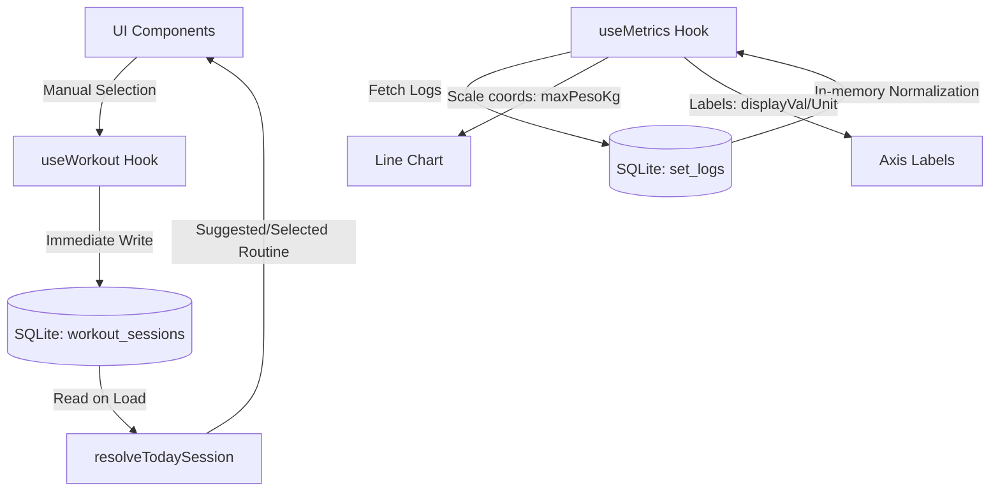

# Technical Design: Gym Improvements

## 1. Technical Approach
Enhance gym tracking capabilities through:
- **Calendar-based Suggestions**: Mapping routine recommendations directly to the system day of the week.
- **Immediate SQLite Sync**: Instantly persisting manual routine overrides.
- **Mixed Weight Normalization**: Processing and scaling mixed units in memory, while displaying raw values on labels.
- **Vertical Picker Overlay**: Replacing the exercise selection carousel with a modal.
- **Strict Timer Cleanup**: Full cancellation of scheduled Notifee notifications and DB cleanup on cancel/skip.

## 2. Architecture Decisions
- **Suggestions Strategy**: Transition from historical sequence calculation to a deterministic system day-of-week resolver.
- **Manual Overrides**: Persisting selected routine rows in `workout_sessions` with `completada = 0`. Conflict resolution clears existing uncompleted sessions for the day.
- **Normalization Strategy**: SQLite query fetches raw values. Normalization occurs in-memory using TypeScript, caching the last bodyweight for `bw` logs. This isolates UI scaling from database representation.

## 3. Data Flow


## 4. File Changes
| Path | Action | Description |
|---|---|---|
| `src/utils/sessionRotation.ts` | Modify | Implement day-of-week suggestion mapping. |
| `src/hooks/useWorkout.ts` | Modify | Persist manual routine selections in SQLite immediately. |
| `src/types/metrics.ts` | Modify | Update `StrengthPoint` type signature. |
| `src/hooks/useMetrics.ts` | Modify | Implement in-memory mixed weight unit normalization. |
| `app/(tabs)/progress.tsx` | Modify | Refactor exercise selector to overlay modal; apply styling/labels. |
| `src/services/timerService.ts` | Modify | Cancel Notifee trigger notifications and delete active DB timer rows. |

## 5. Interfaces / Contracts

### types/metrics.ts
```typescript
export interface StrengthPoint {
  weekStart: string;
  maxPesoKg: number; // Normalized weight in kg
  displayVal: number; // Original logged weight
  displayUnit: string; // Original logged unit
}
```

### utils/sessionRotation.ts
```typescript
export function getSuggestedRoutine(date: Date): string {
  const day = date.getDay(); // 0 = Sunday, 1 = Monday, etc.
  const mapping = ['descanso', 'Torso A', 'Pierna A', 'Ligero', 'Torso B', 'Pierna B', 'descanso'];
  return mapping[day] || 'descanso';
}
```

## 6. Testing Strategy
| Test Level | Scope | Validation Goal |
|---|---|---|
| Unit | `sessionRotation.test.ts` | Verify day-of-week suggestion mapping. |
| Unit | `metricsNormalization.test.ts` | Verify weight normalization conversions (`lb`, `placa`, `bw`). |
| Integration | SQLite Routine Override | Ensure manual overrides are written immediately and survive app restart. |
| Integration | Timer Cancellation | Verify Notifee cancellation calls on cancel/skip. |
| E2E | Exercise Selector Modal | Validate selector modal opens, scroll behaves vertically, updates active state, and closes. |

## 7. Migration / Rollout
No database schema changes are required. Standard codebase rollout. Existing workout logs remain unchanged.
